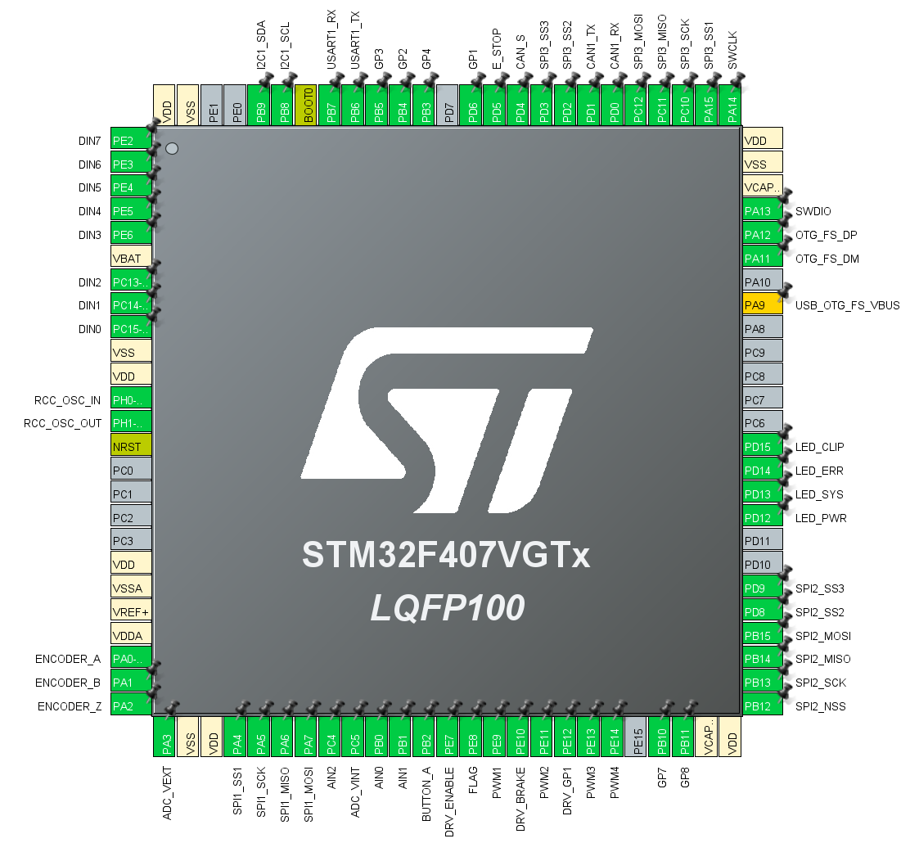

## F407_DISCO target for devboards

This build is intended for third party devkits mainly the official ST F407-Discovery board.

The pinout is closely based on the MMOS/OSW pinouts and should match up for the most part.

USB Vbus sense is disabled and not required here so it should work on boards without that connection. But that also means it will not detect the connection if powered externally.

### Pinout
