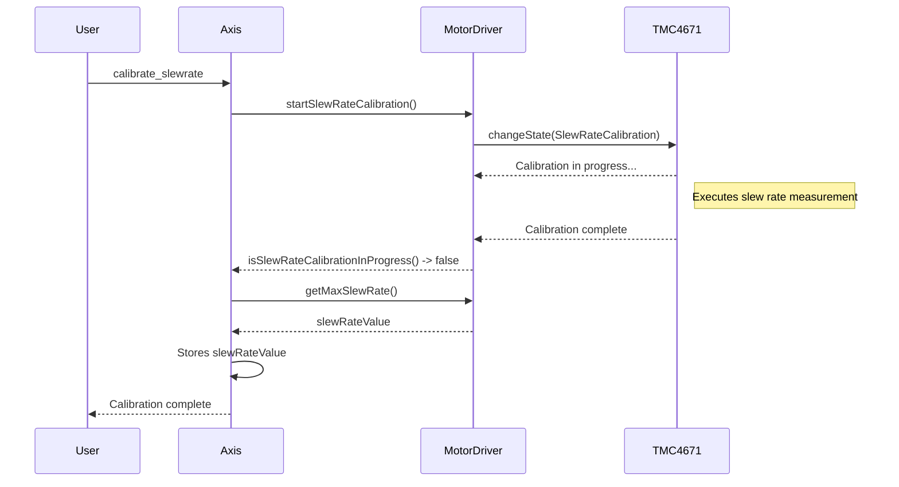

# Maximum Slew Rate Detection Design

This document describes the design for detecting and using the Maximum Slew Rate in the OpenFFBoard firmware.

## 1. Objectives

*   **Flexibility:** The design should support different types of drivers, whether or not they have integrated slew rate detection capabilities.
*   **Robustness:** The system must be able to handle cases where the slew rate cannot be measured.
*   **Logic Centralization:** The `Axis` class should remain the central point for managing axis parameters, including the slew rate.

## 2. Proposed Architecture

### 2.1. `MotorDriver` (Base Class)

The `MotorDriver` class is extended with a calibration interface:

*   `virtual void startSlewRateCalibration()`: Launches the slew rate calibration procedure. The default implementation does nothing. Subclasses that support calibration (like `TMC4671`) will override this method.
*   `virtual bool isSlewRateCalibrationInProgress()`: Returns `true` if a calibration is in progress.
*   `virtual uint16_t getMaxSlewRate()`: Returns the measured maximum slew rate or a default value.

### 2.2. `TMC4671` (Specific Implementation)

The `TMC4671` class will implement the calibration interface:

*   `startSlewRateCalibration()`: Transitions the internal state machine to the `SlewRateCalibration` state.
*   `isSlewRateCalibrationInProgress()`: Returns `true` if the state is `SlewRateCalibration`.
*   `getMaxSlewRate()`: Returns the slew rate value stored in the TMC4671 registers after calibration.

### 2.3. `Axis`

The `Axis` class manages high-level logic:

*   **User Command:** A `calibrate_slewrate` command is added to `Axis`. When called, it executes `driver->startSlewRateCalibration()`.
*   **Polling:** `Axis` can poll `driver->isSlewRateCalibrationInProgress()` to inform the user of the calibration's completion.
*   **Value Retrieval:** Once calibration is complete, `Axis` calls `driver->getMaxSlewRate()` to retrieve the value and stores it.
*   **Fallback:** If `getMaxSlewRate()` returns a value indicating that calibration is not supported, `Axis` uses the maximum power (`power`) as the limit for the slew rate, ensuring safe behavior.
*   **User Interface:** The GUI (Configurator) can use these commands to allow the user to start the calibration and visualize the measured value.

## 3. Sequence Diagram

## 4. Advantages of this Design

*   **Decoupling:** `Axis` does not need to know the details of the TMC4671 state machine.
*   **Extensibility:** It is easy to add new drivers with their own calibration mechanisms.
*   **Security:** The fallback mechanism ensures that the system remains stable even with non-calibratable drivers.
